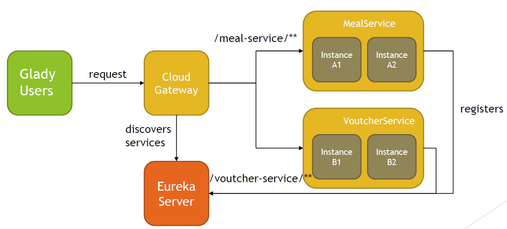

# Installation guide
build the project submodules :
* **mvn clean install** (on the parent folder glady if you wanna build all the microservice architecture)

* or just **mvn clean install** in **meal-deposits-service and voutcher-deposits-service submodules**
* use the command : **mvn spring-boot:run** to run any of the submodules of the project
* **run eureka server** first then run the other services/apis after
* this is the architecture of my webservice solution :

# Wedoogift Backend challenge
You are interested in joining our team ? try to accomplish this challenge, we will be glad to see
your code and give you feedback.

## Guidelines
* Use Java to accomplish this challenge.
* Clone this repo (do not fork it)
* Only do one commit per level and include the `.git` when submitting your test
* We are not expecting any user interface for this challenge. 

## Evaluation
We will look at:
* How you use OOP.
* Your code quality.
* The design patterns you use.
* Your ability to use unit tests.

## Statements

Companies can use Wedoogift services to distribute:
- Gift deposits
- Meal deposits
### Gift deposits
Gift deposits has 365 days lifespan, beyond this period it will no longer be counted in the user's balance.

example:
John receives a Gift distribution with the amount of $100 euros from Tesla. he will therefore have $100 in gift cards in his account.
He received it on 06/15/2021. The gift distribution will expire on 06/14/2022. 
### Meal deposits
Meal deposit works like the Gift deposit excepting for the end date. In fact meal deposits expires at the end of February of the year following the distribution date.

example:
Jessica receives a Meal distribution from Apple with the amount of $50 on 01/01/2020, the distribution ends on 02/28/2021.

* Implement one or two functions allowing companies to distribute gift and meal deposits to a user if the company balance allows it.
* Implement a function to calculate the user's balance.

